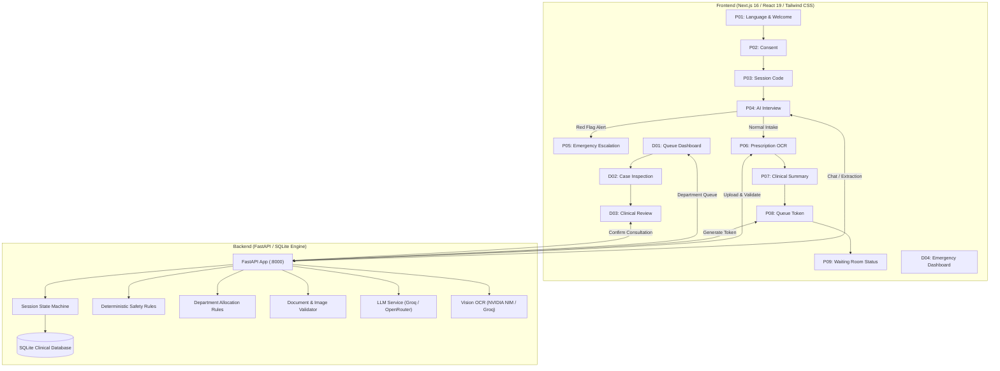

# MediKiosk — Clinical AI Reception & Triage Kiosk System

[](https://github.com/Deadpool20x/Medikiosk/actions/workflows/ci.yml)
[](https://fastapi.tiangolo.com)
[](https://nextjs.org)
[](https://python.org)
[](backend/tests)
[](backend/audit.py)

MediKiosk is an intelligent, bilingual clinical reception, intake triage, and doctor queue management kiosk designed for outpatient departments (OPDs) in public healthcare centers and hospitals (Smart India Hackathon 2026).

---

## 🏥 Problem Statement & Solution

### The Challenge
- **OPD Congestion & Long Waiting Times**: Overwhelmed reception counters cause hours of unstructured queue delays.
- **Triage Delays & Safety Risks**: Critical emergency symptoms (e.g., chest pain, respiratory distress, acute trauma) frequently go unnoticed in general queues.
- **Fragmented Medical History**: Patients present handwritten, crumpled past prescriptions without digitisation, slowing down clinical consultations.

### The MediKiosk Solution
- **Automated Self-Service Intake**: Patients select their preferred language, consent to triage intake, receive a secure session code, and answer dynamic clinical interview questions.
- **Deterministic Red-Flag Safety Engine**: Instant priority-0 detection of life-threatening symptoms escalates emergencies immediately to the Emergency Dashboard before queue entry.
- **Vision-Language Prescription OCR**: Vision LLMs extract medications, dosages, and past diagnoses from uploaded prescription images into structured clinical summaries.
- **Doctor Consultation Workspace**: Real-time department queues (General Medicine, Cardiology, Pulmonology, Orthopedics, Emergency), automated clinical summaries, and instant prescription review.

---

## 🏛️ System Architecture



### Technology Stack
- **Frontend**: Next.js 16 (App Router), React 19, TypeScript, Tailwind CSS, Lucide React.
- **Backend**: FastAPI, Uvicorn, Python 3.11+, Pydantic v2.
- **Database**: SQLite with transactional session locking and state-bypass protection.
- **LLM / Vision AI Providers**:
  - Chat & Extraction: Groq (`openai/gpt-oss-20b`, `meta-llama/llama-3.3-70b-instruct`).
  - Prescription OCR: NVIDIA NIM (`meta/llama-3.2-11b-vision-instruct`) with multi-provider fallback.
- **Testing & Quality Assurance**: Pytest (159 unit/integration tests), Custom State Bypass Auditor (9/9 invariant checks), Playwright E2E suites.

---

## 🔄 Core Workflows

### 1. Patient Intake Flow (`P01`–`P09`)
1. **P01 Welcome**: Select language (English / Hindi / Regional).
2. **P02 Consent**: Explicit clinical intake and data processing consent.
3. **P03 Session Generation**: Generates 6-character non-hardcoded patient identifier.
4. **P04 Clinical Interview**: Adaptive question-and-answer cycle extracting chief complaints, symptom duration, and severity. Supports browser refresh and resume.
5. **P05 Safety Escalation (Conditional)**: Triggered immediately when critical clinical red flags are detected. Directs the patient to the emergency desk.
6. **P06 Prescription Upload & OCR**: Upload past medical prescriptions. Real-time file integrity validation (MIME sniffing, magic bytes, dimensions, 8MB max size).
7. **P07 Summary Review**: Clean, verified patient summary display.
8. **P08 Token Generation**: Deterministic token assignment and department routing.
9. **P09 Waiting Room Tracker**: Live queue position tracking.

### 2. Doctor Workspace Flow (`D01`–`D04`)
1. **D01 Department Queue**: Filter patients by department (General Medicine, Cardiology, Orthopedics, Pediatrics, etc.) with real-time priority sorting.
2. **D02 Case Detail View**: Comprehensive patient card showing chief complaints, symptom duration, extracted medications, and uploaded prescription images.
3. **D03 Clinical Review**: Doctor updates diagnosis, approves or modifies prescription, and confirms consultation.
4. **D04 Emergency Alerts Dashboard**: Real-time triage monitor for safety-flagged patients requiring immediate medical intervention.

---

## 🚀 Getting Started

### Prerequisites
- **Python**: 3.11 or higher
- **Node.js**: 18.17 or higher
- **npm**: 9.0 or higher
- **Git**

### 1. Clone the Repository
```bash
git clone https://github.com/Deadpool20x/Medikiosk.git
cd Medikiosk
```

### 2. Environment Configuration
Copy the example environment configuration:
```bash
cp .env.example .env
```
Edit `.env` to supply your API credentials:
```env
# Primary LLM Provider (Groq)
GROQ_API_KEY=your_groq_api_key_here
GROQ_MODEL=openai/gpt-oss-20b

# Vision OCR Provider (NVIDIA NIM)
NVIDIA_NIM_API_KEY=your_nvidia_nim_api_key_here
NVIDIA_NIM_MODEL=meta/llama-3.2-11b-vision-instruct

# Fallback LLM Provider (OpenRouter)
OPENROUTER_API_KEY=your_openrouter_api_key_here
OPENROUTER_MODEL=meta-llama/llama-3.3-70b-instruct:free

# Server & Database Settings
PORT=8000
DATABASE_URL=sqlite:///./data/medikiosk.db
```

### 3. Backend Setup
```bash
# Create and activate virtual environment
python -m venv venv
# Windows
.\venv\Scripts\activate
# Linux / macOS
source venv/bin/activate

# Install dependencies
pip install -r backend/requirements.txt

# Start backend service
python -m uvicorn backend.main:app --host 0.0.0.0 --port 8000
```
Verify backend health:
```bash
curl http://localhost:8000/health
# Response: {"status":"ok"}
```

### 4. Frontend Setup
In a new terminal:
```bash
cd frontend
npm ci
npm run dev
```
Open [http://localhost:3000](http://localhost:3000) in your browser.

---

## 🧪 Verification & Testing

MediKiosk enforces rigorous automated testing and invariant auditing before any release.

### Run Backend Unit & Integration Tests
```bash
pytest backend/tests -v
```
*Current status: 159 tests passing, 0 failures.*

### Run State Bypass & Clinical Safety Audit
```bash
python -m backend.audit
```
*Current status: 9/9 invariants verified (incomplete interview prevention, safety flag locking, document state verification, upload tamper protection).*

### Seed Controlled Demo Data
To immediately test the doctor workspace with pre-populated synthetic patient profiles and valid tokens:
```bash
python scripts/make_demo.py
```

### Run End-to-End Browser Tests
```bash
# Verify Patient Journey
node scripts/e2e_patient_journey.js

# Verify Red-Flag Safety Escalation
node scripts/e2e_safety_journey.js

# Verify Doctor Queue & Consultation Flow
node scripts/e2e_doctor_journey.js
```

---

## 🔒 Security & Privacy Architecture

- **Zero Hardcoded Secrets**: All API keys and credentials are read exclusively from system environment variables.
- **Strict Upload Hardening**: Multi-layered document validation checks file size (≤8MB), MIME headers, binary magic numbers, and image dimensions to block malformed or malicious payloads.
- **State Machine Integrity**: Patients cannot bypass steps (e.g. attempting to generate a queue token without completing the clinical interview returns `HTTP 403 Forbidden`).
- **Safety Rule Non-Override**: Once a session is flagged as a clinical emergency (`safety_flagged=true`), it cannot be downgraded or routed to a normal OPD queue.

For disclosure procedures, review [SECURITY.md](SECURITY.md).

---

## ⚠️ Limitations & SIH Demo Scope

1. **Synthetic Data**: All demo patients, prescriptions, and medical histories are synthetically generated for hackathon demonstration purposes.
2. **Clinical Decision Support**: MediKiosk is an intake assistance tool and queue triaging system; it does not replace professional medical diagnosis by licensed healthcare practitioners.
3. **Local Loopback Demo**: The current deployment profile runs across localhost ports `:8000` and `:3000` with an isolated SQLite database.

---

## 👥 Contributors & Acknowledgements

Developed for **Smart India Hackathon 2026** (SIH 2026).
- Team: MediKiosk Development Team
- Design Master: Frozen Stitch Clinical UI/UX System (`stitch_medikiosk_FINAL/`)
