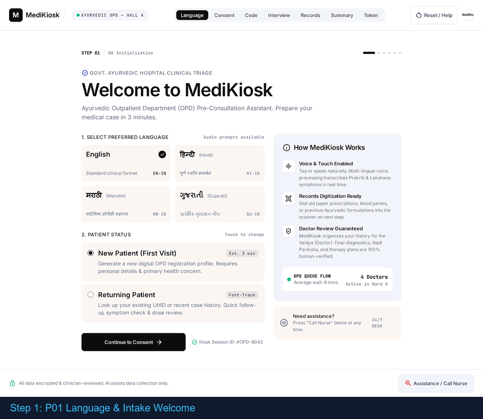
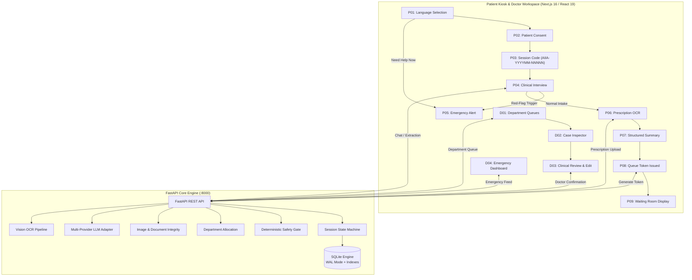
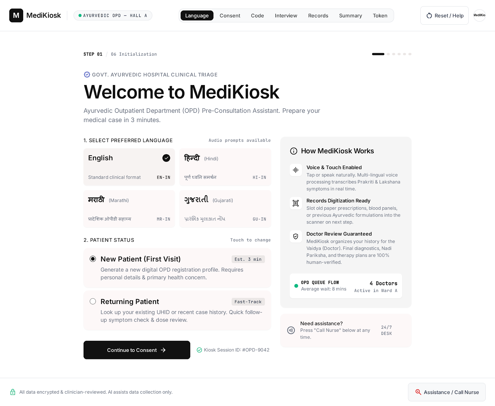
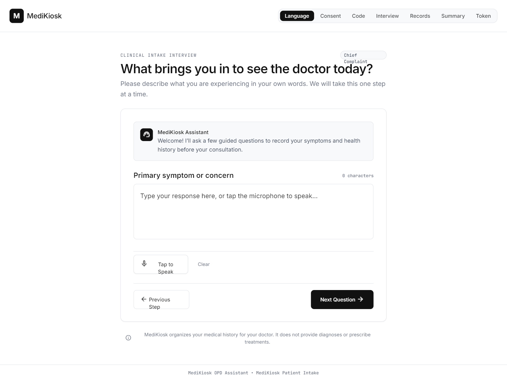
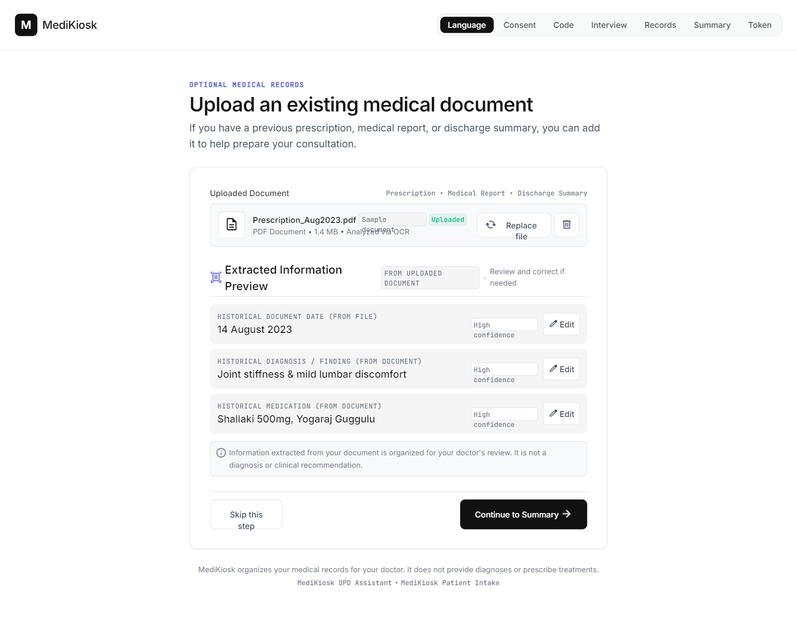
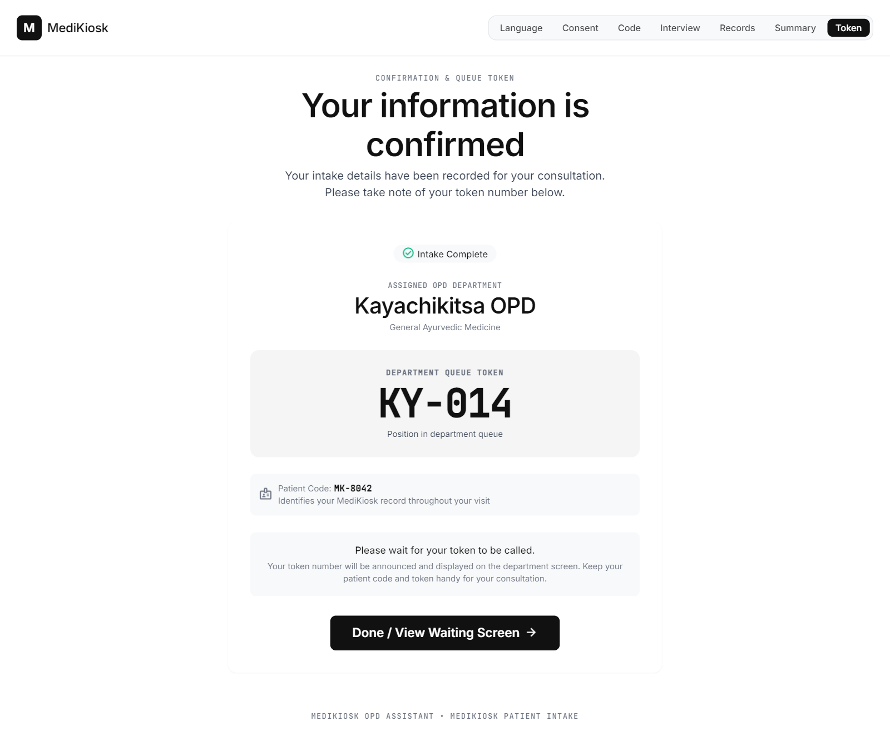
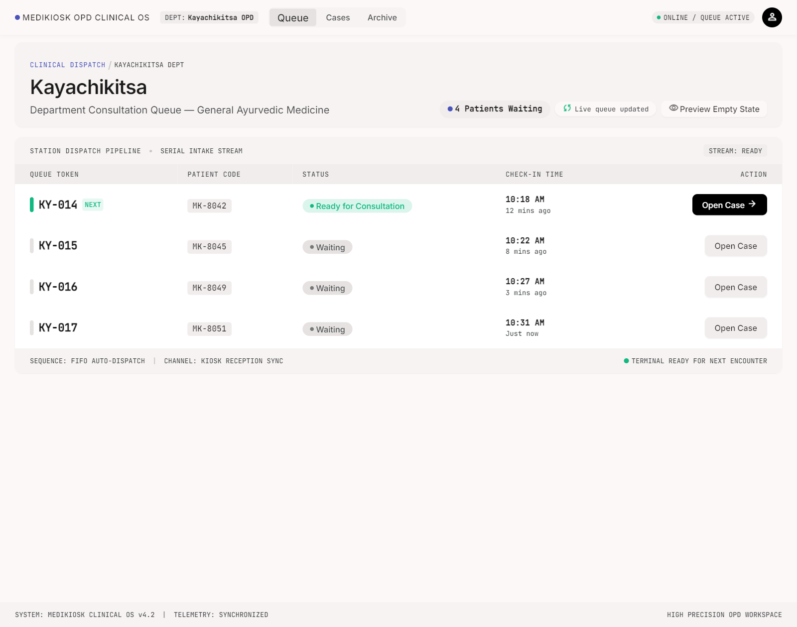
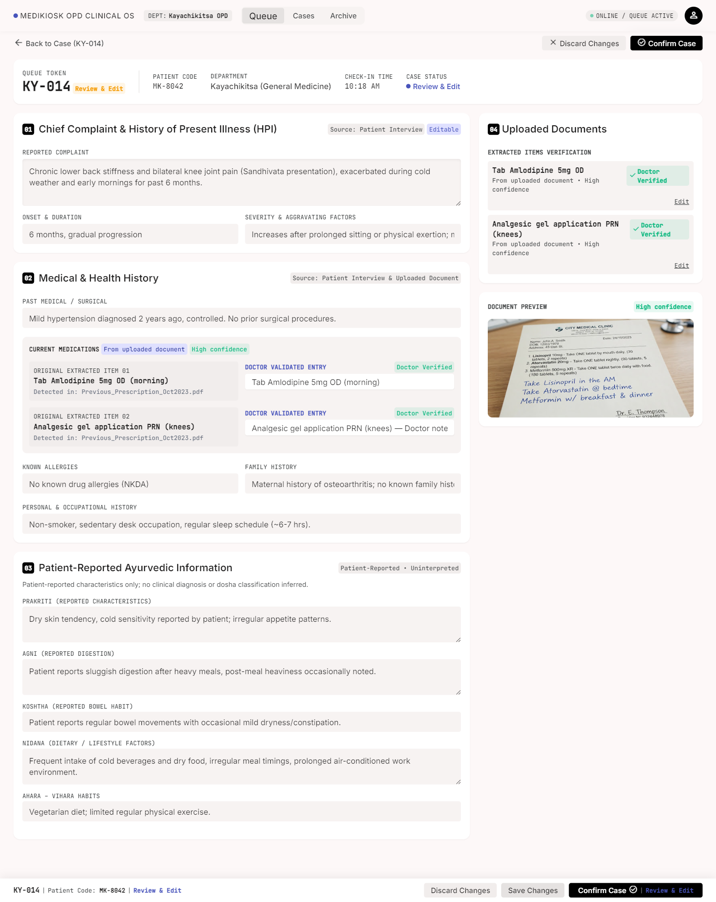

<div align="center">


# MediKiosk

### Clinical AI Reception & Deterministic Triage Kiosk System

[](https://fastapi.tiangolo.com)
[](https://nextjs.org)
[](https://python.org)
[](backend/tests)
[](backend/audit.py)
[](LICENSE)

An intelligent, multilingual clinical intake and OPD queue triage kiosk engineered for high-volume hospital outpatient departments.

[Live Demo](#-live-demonstration-storyline) • [Architecture](#-system-architecture) • [Quick Start](#-quick-start) • [Safety Model](#-deterministic-safety-model) • [Documentation](#-project-documentation)

---



</div>

---

## 📋 Table of Contents

- [Overview](#-overview)
- [System Architecture](#-system-architecture)
- [Deterministic Safety Model](#-deterministic-safety-model)
- [Key Features](#-key-features)
- [Interactive Visual Tour](#-interactive-visual-tour)
- [Quick Start](#-quick-start)
- [Environment Configuration](#-environment-configuration)
- [API Reference](#-api-reference)
- [Testing & Quality Assurance](#-testing--quality-assurance)
- [Repository Structure](#-repository-structure)
- [Live Demonstration Storyline](#-live-demonstration-storyline)
- [Project Documentation](#-project-documentation)
- [License & Disclaimer](#-license--disclaimer)

---

## 🏥 Overview

Public hospital outpatient departments (OPDs) face staggering patient congestion, multi-hour counter delays, and fragmented medical records. Crucially, critical red-flag emergencies often sit unrecognized in general queues.

**MediKiosk** resolves these bottlenecks at the point of arrival:
1. **Multilingual Patient Self-Service**: Guides patients through touch-based intake in English, Hindi, Marathi, or Gujarati with structured language fallbacks.
2. **Sequential Hospital Patient Code**: Generates standard `AIIA-YYYYMM-NNNNN` tracking codes (e.g. `AIIA-202609-00001`) with persistent atomic sequence counters.
3. **Adaptive Clinical Interview & Document Advisory**: Collects chief complaints and history of present illness (onset, duration, severity, character), alerting patients to scan past prescriptions or lab records.
4. **Dual Emergency Front Door & Safety Gate**: An always-visible `🚨 Need Help Now` button plus deterministic red-flag keyword screening divert emergencies to triage immediately—independent of LLM inference.
5. **Vision Prescription OCR**: Digitizes handwritten and printed past prescriptions, extracting structured medications, strengths, and dosages.
6. **Doctor Workspace**: Provides real-time, department-routed OPD queues (Kayachikitsa, Panchakarma), structured summaries, and complete physician editing agency.

---

## 🏛️ System Architecture



### Technical Stack & Boundaries
- **Frontend**: Next.js 16 (App Router), React 19, TypeScript, Tailwind CSS v4.
- **Backend**: FastAPI, Uvicorn, Python 3.11+, Pydantic v2.
- **Database**: SQLite with Write-Ahead Logging (`PRAGMA journal_mode = WAL;`), 30-second busy timeout locks, and compound query indexes.
- **Multi-Provider AI Fallback**:
  - **Conversational Extraction**: Groq (`openai/gpt-oss-20b`) → Cerebras (`llama-3.3-70b`) → NVIDIA NIM. OpenRouter is defined as a provider class but excluded from the LLM chain (dead credentials).
  - **Prescription Vision OCR**: Google Gemini Vision (`gemini-2.5-flash`, env-configurable via `GEMINI_VISION_MODEL`), Groq Vision (`llama-3.2-11b-vision-preview`).

---

## 🛡️ Deterministic Safety Model

MediKiosk enforces a fundamental architectural boundary between natural language processing and clinical safety.

| Capability | Engine Type | Authority | Failure Behavior |
| :--- | :--- | :--- | :--- |
| **Emergency Detection** | Deterministic Keyword Screener | **Absolute Authority** | Immediate Lockout to P05; Token Denied (HTTP 403) |
| **Department Routing** | Deterministic Rules Table | **Absolute Authority** | Fallback to Kayachikitsa OPD |
| **Token Generation** | Transactional Sequence Engine | **Absolute Authority** | Locked until all state prerequisites verified |
| **Interview Extraction** | Multi-Provider LLM | Assistive Extractor | Structured state parsing with human-in-the-loop review |
| **Prescription Digitization** | Vision-Language Model | Assistive Extractor | Confidence gated (<0.5 flagged for doctor review) |

> [!IMPORTANT]
> **Safety Guarantee**: The Large Language Model is NEVER consulted to determine whether a patient is having a medical emergency. Red-flag symptoms (such as acute chest pain, respiratory distress, or severe hemorrhage) trigger immediate deterministic diversion to emergency care.

---

## ✨ Key Features

- 🌐 **Multilingual Touch Interface**: Native support for English, Hindi, Marathi, and Gujarati.
- ⏱️ **Zero-Bypass State Machine**: Sequential state gates prevent token generation without verified intake.
- 📄 **Prescription OCR & Schema Validation**: Robust upload verification (magic-byte check, MIME verification, 8MB boundary, Pillow decode).
- 🏥 **Department Allocation**: Automated, deterministic routing into Kayachikitsa and Panchakarma OPDs.
- 🩺 **Doctor Confirmation Control**: Full physician agency to inspect, edit, or override any extracted symptom or medication before final clinical confirmation.
- 🔒 **Hardened Local Architecture**: Loopback-guarded clinician workspace with optional secret token header verification (`X-Doctor-Token`).

---

## 📸 Interactive Visual Tour

| Patient Intake (P01) | Clinical Interview (P04) |
| :---: | :---: |
|  |  |
| *Language selection and touch kiosk intake initiation.* | *Adaptive structured interview extracting chief complaints.* |

| Prescription OCR (P06) | Token Issuance (P08) |
| :---: | :---: |
|  |  |
| *Multi-provider vision digitization of past prescription.* | *Official OPD token issued after deterministic gate validation.* |

| Doctor Queue (D01) | Clinical Review & Edit (D03) |
| :---: | :---: |
|  |  |
| *Real-time department queue with triage status indicators.* | *Physician inspection, entity editing, and case confirmation.* |

---

## 🚀 Quick Start

### Prerequisites
- **Python**: 3.11 or 3.12
- **Node.js**: 18.18+ or 20+
- **Package Managers**: `pip`, `npm`

### 1. Clone & Configure
```bash
git clone https://github.com/Deadpool20x/Medikiosk.git
cd Medikiosk

# Configure environment variables
cp .env.example .env
```

### 2. Start Backend Core
```bash
# Set up virtual environment
python -m venv .venv

# On Windows:
.\.venv\Scripts\Activate.ps1
# On Linux/macOS:
# source .venv/bin/activate

# Install dependencies
pip install -r backend/requirements.txt

# Seed demo dataset (optional)
python scripts/seed_demo.py

# Start FastAPI server
python -m uvicorn backend.main:app --port 8000
```
Backend health check: [http://localhost:8000/health](http://localhost:8000/health)

### 3. Start Frontend Kiosk
In a separate terminal:
```bash
cd frontend
npm ci
npm run build
npm start
```
Open Kiosk: [http://localhost:3000](http://localhost:3000) • Doctor Workspace: [http://localhost:3000/doctor](http://localhost:3000/doctor)

---

## ⚙️ Environment Configuration

| Variable | Default Value | Description |
| :--- | :--- | :--- |
| `GROQ_API_KEY` | *(Required for LLM)* | Groq Cloud API key for interview extraction |
| `GROQ_MODEL` | `openai/gpt-oss-20b` | Model ID used for conversational extraction |
| `CEREBRAS_API_KEY` | *(Optional)* | Cerebras Cloud API key for LLM fallback (1M tokens/day free tier) |
| `CEREBRAS_MODEL` | `llama-3.3-70b` | Cerebras model ID for conversational extraction |
| `GEMINI_API_KEY` | *(Optional)* | Google Gemini API key for prescription OCR |
| `GEMINI_VISION_MODEL` | `gemini-2.5-flash` | Configurable Google Gemini Vision model ID |
| `NVIDIA_NIM_API_KEY` | *(Optional)* | NVIDIA NIM fallback key (capped 7s timeout) |
| `BACKEND_PORT` | `8000` | FastAPI server listening port |
| `DATABASE_URL` | `sqlite:///./backend/data/medikiosk.db` | SQLite database connection string |
| `NEXT_PUBLIC_API_URL`| `http://localhost:8000` | Target backend REST endpoint for Next.js |
| `DOCTOR_SECRET_TOKEN`| *(Optional)* | When set, requires `X-Doctor-Token` header on doctor API |

---

## 📡 API Reference

### Patient Session Endpoints (`/session`)

| Method | Endpoint | Description | Invariant Enforcement |
| :--- | :--- | :--- | :--- |
| `POST` | `/session/start` | Initialize new patient intake session | Generates UUID & tracking session |
| `POST` | `/session/{id}/consent` | Record patient intake consent | Prerequisite for patient code generation |
| `POST` | `/session/{id}/patient-code`| Issue sequential hospital code | `AIIA-YYYYMM-NNNNN` format with atomic prefix counter |
| `POST` | `/session/{id}/emergency`| Direct emergency assistance trigger | Immediate lockout to P05; routes case to triage |
| `GET` | `/session/{id}` | Retrieve current session state | Returns 404 for invalid ID |
| `POST` | `/session/{id}/answer` | Submit clinical interview response | Evaluates deterministic safety rules |
| `POST` | `/session/{id}/upload` | Upload previous prescription image | Rejects >8MB, invalid magic bytes, or corrupt files |
| `POST` | `/session/{id}/documents-complete`| Mark records phase completed | Prerequisite for queue token generation |
| `POST` | `/session/{id}/token` | Issue official OPD queue token | Returns 403 if interview incomplete or safety flagged |

### Doctor Workspace Endpoints (`/doctor`)

| Method | Endpoint | Description | Invariant Enforcement |
| :--- | :--- | :--- | :--- |
| `GET` | `/doctor/queue` | List tokenized patients in OPD queue | Filterable by department (`?department=...`) |
| `GET` | `/doctor/emergency` | List active emergency red-flag cases | Displays immediate clinical alerts |
| `GET` | `/doctor/session/{id}` | Retrieve comprehensive case details | Full history, OCR records, and intake notes |
| `PATCH` | `/doctor/session/{id}` | Edit clinical notes or confirm case | Returns 409 if confirming a safety-flagged case |
| `PATCH` | `/doctor/session/{id}/document/{i}`| Correct OCR-extracted medication | Updates medicine, dose, strength, or frequency |

---

## 🧪 Testing & Quality Assurance

MediKiosk is verified against comprehensive automated testing suites:

```bash
# Run backend pytest suite (238 tests)
pytest backend/tests -v

# Run 9-point clinical invariant audit
python backend/audit.py

# Run real multi-role end-to-end simulation
python scripts/simulate_roles_e2e.py

# Verify frontend TypeScript types
npx --prefix frontend tsc --noEmit

# Verify frontend production build
npm --prefix frontend run build
```

---

## 📁 Repository Structure

```
Medikiosk/
├── assets/                       # Visual assets, brand marks, and screenshot gallery
│   ├── brand/                    # Official SVG and PNG clinical brand logos
│   ├── demo/                     # End-to-end animated patient flow GIF
│   └── screenshots/              # High-fidelity screen captures (P01-P08, D01-D04)
├── backend/                      # FastAPI backend application
│   ├── data/                     # SQLite database storage directory
│   ├── models/                   # Pydantic schemas and clinical data models
│   ├── routers/                  # API routers (session.py, doctor.py)
│   ├── rules/                    # Deterministic safety & department allocation rules
│   ├── services/                 # LLM provider abstractions & OCR pipeline
│   ├── tests/                    # 164 automated pytest test cases
│   ├── audit.py                  # Clinical state-bypass & invariant audit script
│   ├── db.py                     # SQLite engine with WAL mode and indexing
│   └── main.py                   # FastAPI entrypoint and middleware
├── docs/                         # Detailed engineering documentation
│   ├── ARCHITECTURE.md           # Deep dive on state machine & architecture
│   ├── DEMO.md                   # Live demonstration & evaluation storyline
│   ├── SETUP.md                  # Fresh environment installation guide
│   └── TESTING.md                # Test suite execution and QA protocols
├── frontend/                     # Next.js 16 / React 19 user interface
│   ├── app/                      # App router surfaces (patient kiosk, doctor portal)
│   ├── components/               # Accessible, clinical UI components
│   └── lib/                      # Client API wrappers and state handlers
├── scripts/                      # Controlled demo seeding and E2E runners
├── stitch_medikiosk_FINAL/       # Visual design masters and reference captures
├── CONTRIBUTING.md               # Contribution workflow and safety rules
├── llms.txt                      # AI agent system context and architectural summary
└── README.md                     # Project documentation entrypoint
```

---

## 🎭 Live Demonstration Storyline

For hackathon evaluators and clinical teams, MediKiosk provides three pre-configured demo paths:

1. **Path 1: Standard Multilingual Intake & Prescription OCR**
   - Follow the patient touchscreen from language selection to queue token issuance (`KY-014`).
   - Observe automatic vision extraction of medication names and dosages.
2. **Path 2: Instant Red-Flag Emergency Diversion**
   - Submit acute cardiac symptoms (*"Chest tightness radiating to arm with shortness of breath"*).
   - Verify immediate kiosk lockout to P05 and real-time alert on the Emergency Dashboard (`D04`).
3. **Path 3: Physician Consultation & Case Confirmation**
   - Open Doctor Workspace (`/doctor`) to review department queues.
   - Inspect, edit extracted symptoms, adjust medication dosage, and atomically confirm consultation.

*See [docs/DEMO.md](docs/DEMO.md) for step-by-step instructions and test scenarios.*

---

## 📚 Project Documentation

- [System Architecture (docs/ARCHITECTURE.md)](docs/ARCHITECTURE.md)
- [Installation & Setup Guide (docs/SETUP.md)](docs/SETUP.md)
- [Testing & Invariant Audit Guide (docs/TESTING.md)](docs/TESTING.md)
- [Live Demo Storyline (docs/DEMO.md)](docs/DEMO.md)
- [Contributing Guidelines (CONTRIBUTING.md)](CONTRIBUTING.md)
- [AI Agent Context (llms.txt)](llms.txt)

---

## ⚖️ License & Disclaimer

This project is licensed under the **MIT License** — see the [LICENSE](LICENSE) file for details.

**Clinical Disclaimer**: MediKiosk is an assistive clinical intake, triage, and queue management prototype engineered for research and demonstration purposes. It does not provide autonomous medical diagnosis, treatment recommendations, or medical prescriptions. All medical evaluations must be conducted by qualified healthcare professionals.
